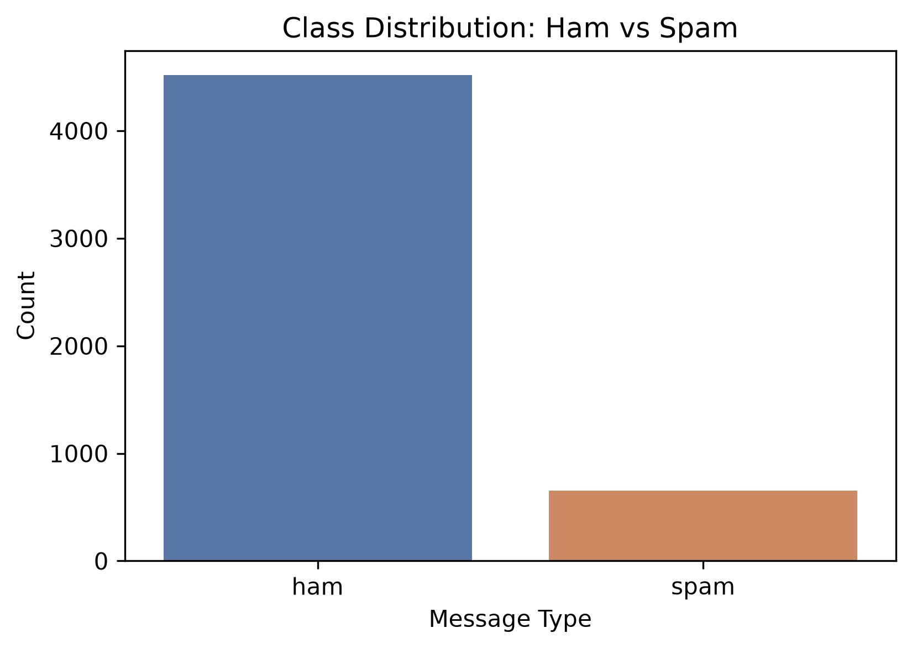
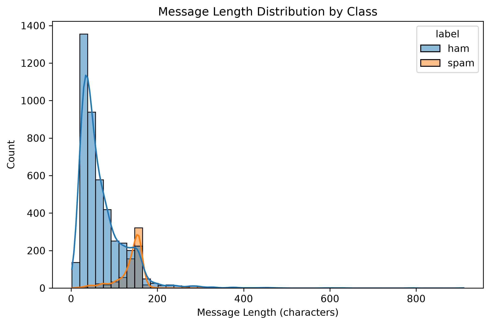
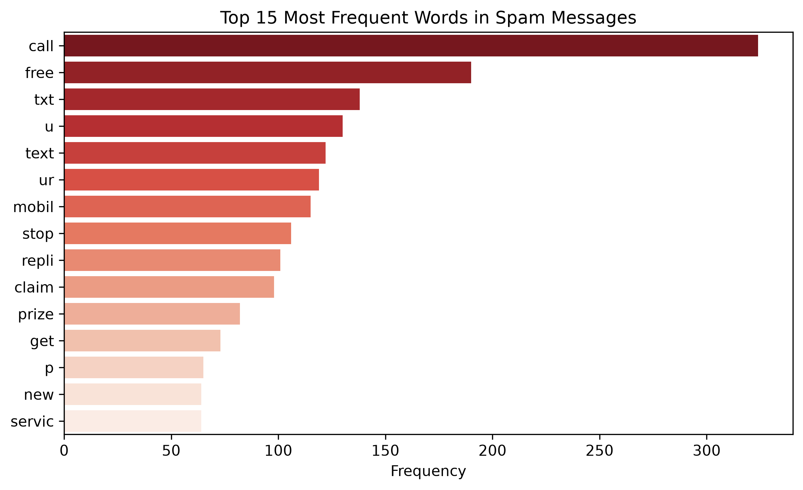
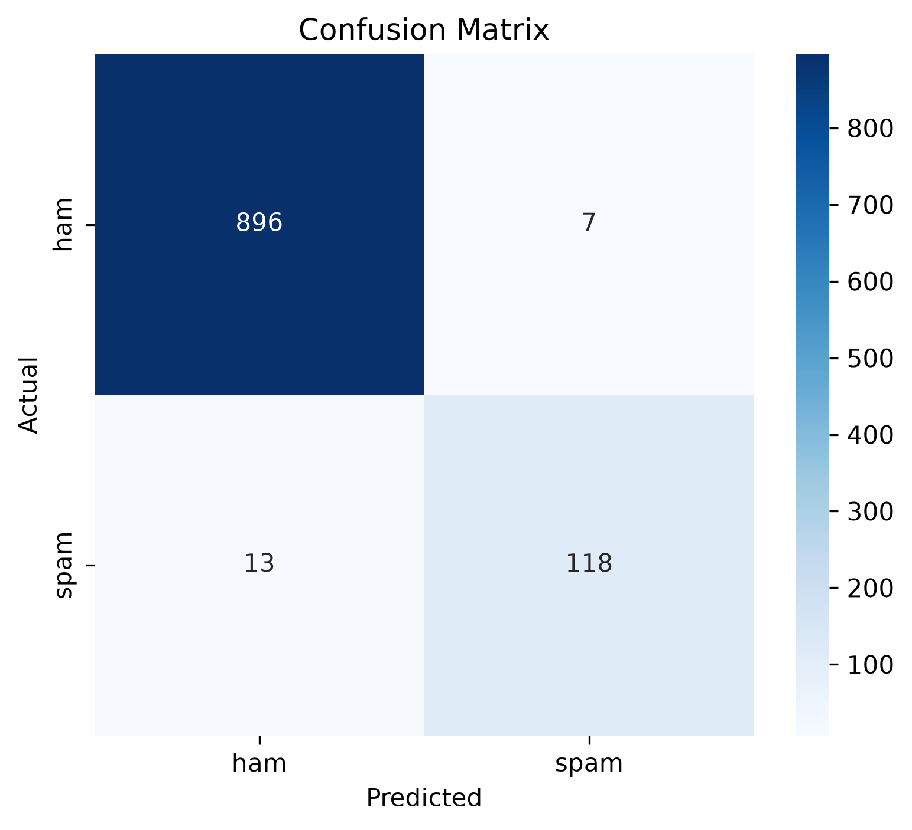
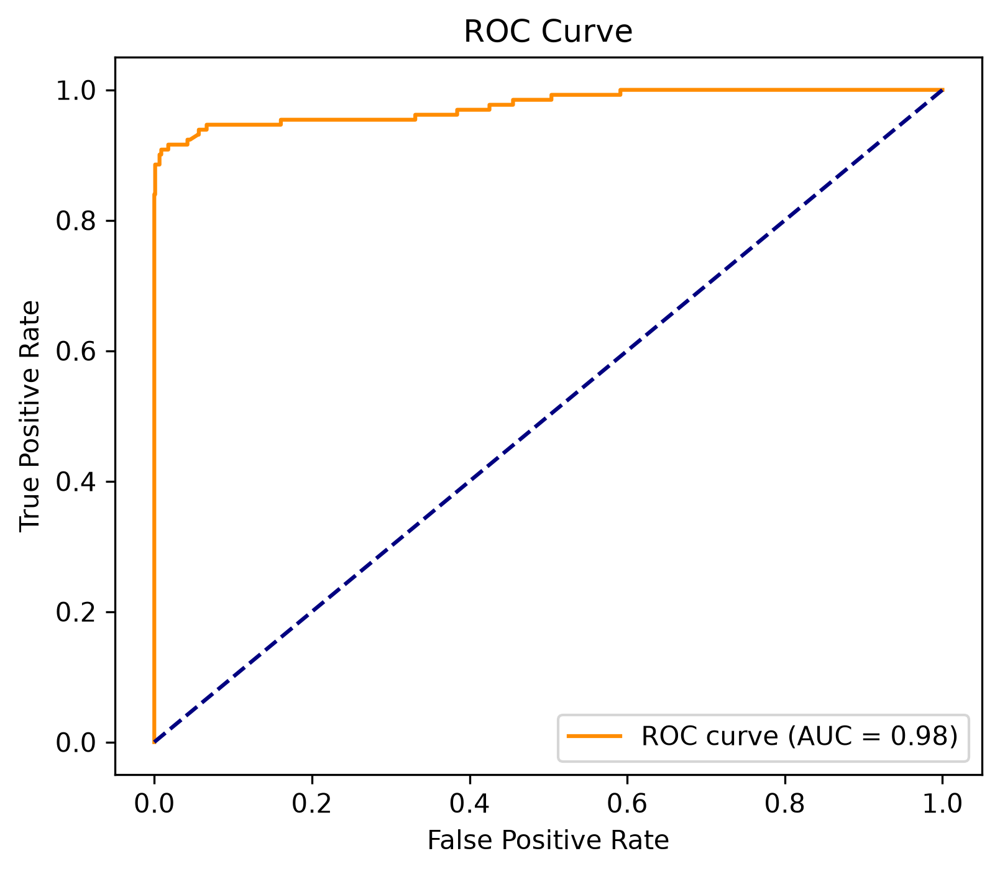

# SMS Spam Detection using Multinomial Naive Bayes

A machine learning project that classifies SMS messages as **spam** or **ham (legitimate)** using the Multinomial Naive Bayes algorithm, achieving **98.07% accuracy** on unseen test data.

---

## Table of Contents

1. [Problem Statement](#1-problem-statement)
2. [Dataset](#2-dataset)
3. [Project Structure](#3-project-structure)
4. [Tech Stack](#4-tech-stack)
5. [Methodology](#5-methodology)
6. [Exploratory Data Analysis](#6-exploratory-data-analysis)
7. [Model Training](#7-model-training)
8. [Results](#8-results)
9. [How to Run This Project](#9-how-to-run-this-project)
10. [Key Learnings](#10-key-learnings)
11. [Future Improvements](#11-future-improvements)
12. [Author](#12-author)

---

## 1. Problem Statement

Unsolicited spam messages are a persistent problem across SMS, email, and messaging platforms. Manually filtering them is impractical at scale. This project builds a text classification model that automatically detects spam messages based on their content, using a probabilistic machine learning approach grounded in Bayes' Theorem — specifically, the **Multinomial Naive Bayes** algorithm, which is a standard, efficient choice for word-count-based text classification.

**Goal:** Given the text of an SMS message, predict whether it is `spam` or `ham` (legitimate) with high precision and recall — precision matters especially, since misclassifying a real message as spam is worse than letting an occasional spam message through.

## 2. Dataset

- **Source:** [SMS Spam Collection Dataset](https://archive.ics.uci.edu/dataset/228/sms+spam+collection) — a well-known public dataset originally compiled for SMS spam research
- **Size:** 5,574 real SMS messages, labeled as `ham` (legitimate) or `spam`
- **Format:** CSV file with message label and message text
- **Class balance:** The dataset is imbalanced — the majority of messages are `ham`, with `spam` making up a smaller minority, which is realistic for real-world messaging traffic

## 3. Project Structure

```
sms-spam-detection/
│
├── data/
│   ├── raw/
│   │   └── spam.csv                   # original untouched dataset
│   └── processed/
│       └── cleaned_data.csv           # cleaned dataset after preprocessing
│
├── notebooks/
│   └── spam_detection.ipynb           # full analysis, training, evaluation
│
├── models/
│   ├── naive_bayes_model.pkl          # trained Multinomial Naive Bayes model
│   └── vectorizer.pkl                 # fitted CountVectorizer
│
├── images/
│   ├── class_distribution.png
│   ├── message_length_distribution.png
│   ├── top_spam_words.png
│   ├── confusion_matrix.png
│   └── roc_curve.png
│
├── src/
│   └── preprocess.py                  # reusable text cleaning function
│
├── requirements.txt                   # exact project dependencies
├── .gitignore
└── README.md
```

## 4. Tech Stack

| Category | Tools |
|---|---|
| Language | Python 3.11 |
| Data Handling | pandas, numpy |
| Machine Learning | scikit-learn (Multinomial Naive Bayes, CountVectorizer) |
| Text Processing | NLTK (stopwords, stemming) |
| Visualization | matplotlib, seaborn |
| Environment | Jupyter Notebook, VS Code, Python venv |
| Model Persistence | joblib |

## 5. Methodology

The project follows a standard end-to-end machine learning pipeline for text classification:

1. **Data Cleaning** — removed duplicate messages, renamed columns to `label` and `message`, encoded labels numerically (`ham` = 0, `spam` = 1)
2. **Exploratory Data Analysis (EDA)** — examined class balance and message length patterns to understand the dataset before modeling
3. **Text Preprocessing** — lowercased text, removed non-alphabetic characters, removed English stopwords, and applied stemming using NLTK's `PorterStemmer`
4. **Vectorization** — converted cleaned text into numerical word-count vectors using scikit-learn's `CountVectorizer`, which is the natural fit for Multinomial Naive Bayes
5. **Train/Test Split** — split the data 80/20, stratified by class to preserve the spam/ham ratio in both sets
6. **Model Training** — trained a `MultinomialNB` classifier on the vectorized training data
7. **Evaluation** — assessed performance using accuracy, precision, recall, F1-score, a confusion matrix, and an ROC curve
8. **Model Persistence** — saved the trained model and vectorizer using `joblib` for future reuse without retraining

## 6. Exploratory Data Analysis

**Class Distribution**

The dataset is imbalanced, with significantly more `ham` messages than `spam` — a realistic reflection of everyday SMS traffic.



**Message Length Distribution**

Spam messages tend to run longer on average than legitimate messages, often because they're packed with promotional text, links, or call-to-action phrases.



**Most Frequent Words in Spam Messages**

After cleaning and stemming, the most common words appearing in spam messages reveal clear promotional patterns — words like "free," "call," "text," and "win" dominate.



## 7. Model Training

The cleaned, stemmed text was converted into word-count vectors using `CountVectorizer`, then fed into a **Multinomial Naive Bayes** classifier — chosen specifically because it models discrete word-frequency data well and is a standard baseline for text classification tasks.

```python
from sklearn.feature_extraction.text import CountVectorizer
from sklearn.naive_bayes import MultinomialNB

vectorizer = CountVectorizer()
X_train_vec = vectorizer.fit_transform(X_train)
X_test_vec = vectorizer.transform(X_test)

model = MultinomialNB()
model.fit(X_train_vec, y_train)
```

## 8. Results

The model was evaluated on a held-out test set of 1,034 messages it had never seen during training.

**Overall Accuracy: 98.07%**

| Class | Precision | Recall | F1-Score | Support |
|---|---|---|---|---|
| Ham | 0.99 | 0.99 | 0.99 | 903 |
| Spam | 0.94 | 0.90 | 0.92 | 131 |
| **Accuracy** | | | **0.98** | 1034 |
| Macro Avg | 0.96 | 0.95 | 0.96 | 1034 |
| Weighted Avg | 0.98 | 0.98 | 0.98 | 1034 |

**Confusion Matrix**

The confusion matrix shows very few misclassifications in either direction, with the model correctly identifying the large majority of both spam and ham messages.



**ROC Curve**

The ROC curve demonstrates strong separability between the two classes, with an AUC score reflecting the model's ability to distinguish spam from ham across all classification thresholds.



### Interpreting the results

- **High ham precision/recall (0.99)** means the model rarely misclassifies a real message as spam — critical for user trust, since flagging legitimate messages as spam is more disruptive than the reverse.
- **Spam precision of 0.94** means when the model flags something as spam, it's correct 94% of the time.
- **Spam recall of 0.90** means the model catches 90% of all actual spam messages in the test set — a small number of spam messages still slip through, which is expected given the class imbalance and the naive independence assumption underlying the algorithm.

## 9. How to Run This Project

**1. Clone the repository**
```bash
git clone https://github.com/<your-username>/sms-spam-detection.git
cd sms-spam-detection
```

**2. Create and activate a virtual environment**
```bash
python -m venv venv
venv\Scripts\Activate.ps1      # Windows
source venv/bin/activate       # Mac/Linux
```

**3. Install dependencies**
```bash
pip install -r requirements.txt
```

**4. Run the notebook**
```bash
jupyter notebook notebooks/spam_detection.ipynb
```

**5. Use the saved model directly** (without retraining)
```python
import joblib

model = joblib.load("models/naive_bayes_model.pkl")
vectorizer = joblib.load("models/vectorizer.pkl")

sample = ["Congratulations! You've won a free prize, call now!"]
sample_vec = vectorizer.transform(sample)
prediction = model.predict(sample_vec)

print("Spam" if prediction[0] == 1 else "Ham")
```

## 10. Key Learnings

- How Bayes' Theorem and the naive conditional independence assumption translate into a working, efficient text classifier
- The importance of proper text preprocessing (stopword removal, stemming) in reducing noise before vectorization
- Why Multinomial Naive Bayes is specifically suited to word-count data, as opposed to Gaussian or Bernoulli variants
- How to evaluate a classifier properly on imbalanced data using precision, recall, and F1-score rather than accuracy alone
- How to structure a machine learning project professionally for collaboration and GitHub presentation

## 11. Future Improvements

- Experiment with **TF-IDF vectorization** instead of raw word counts to see if it improves spam recall
- Address class imbalance using techniques like oversampling (SMOTE) or class weighting
- Compare performance against other algorithms (Logistic Regression, SVM, Random Forest)
- Deploy the model as a simple web app using Flask or Streamlit for live predictions
- Expand the dataset with more recent spam patterns, since spam tactics evolve over time

## 12. Author

**Tousif Khan**
Machine Learning Project — SMS Spam Detection using Multinomial Naive Bayes

If you found this project useful, feel free to star the repository or connect with me on LinkedIn.
